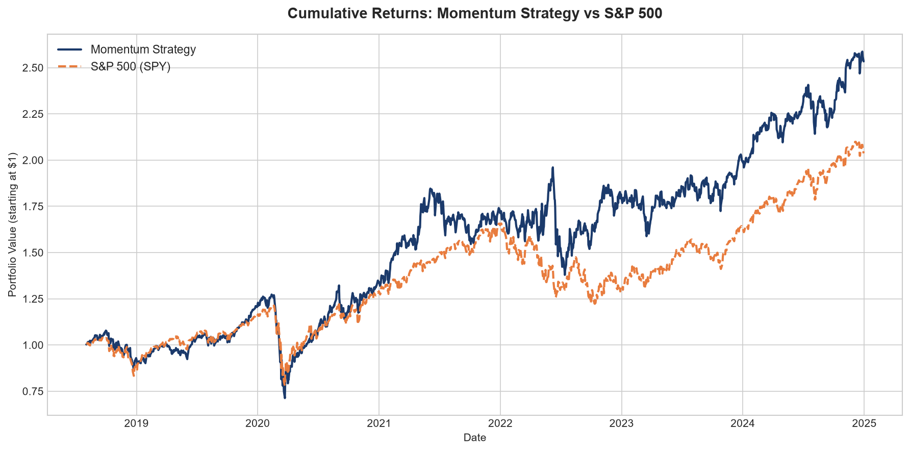
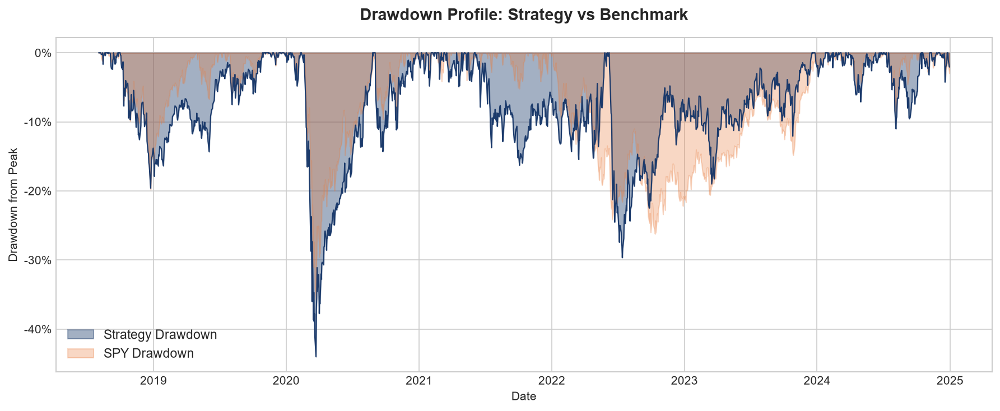
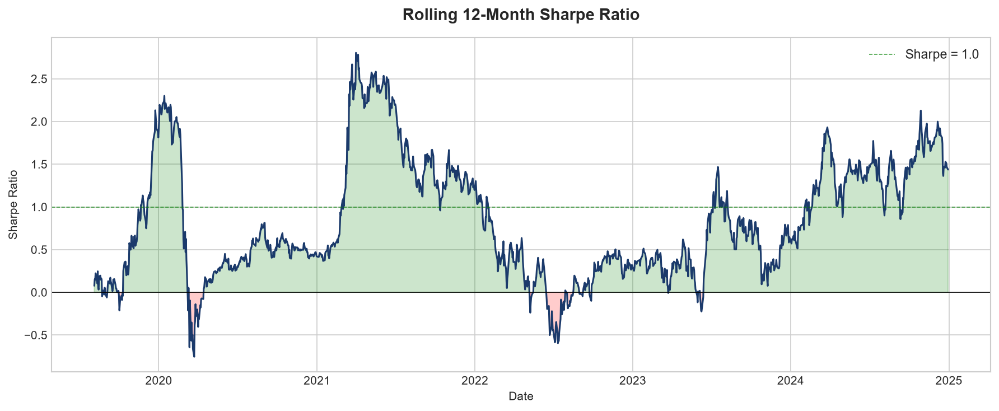
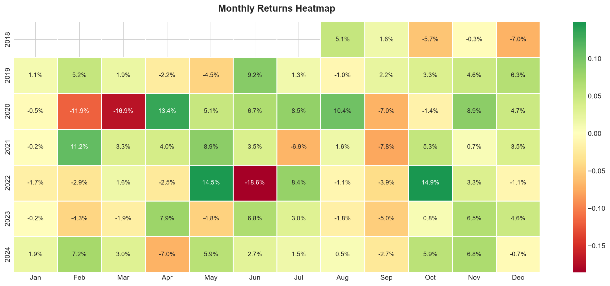

# Equity Momentum & Volatility Backtester

A systematic quantitative trading strategy built in Python, implementing cross-sectional momentum with volatility-targeted position sizing across a diversified universe of large-cap US equities.

---

## Strategy Overview

**Signal:** 6-month cross-sectional momentum (skipping the most recent month to avoid short-term reversal), ranked as a percentile across the investment universe.

**Portfolio Construction:** Long-only, top 5 stocks by momentum rank, rebalanced monthly. Inverse-volatility weighting applied for risk-adjusted position sizing.

**Universe:** 20 large-cap US equities across Technology, Finance, Energy, and Healthcare sectors.

**Benchmark:** S&P 500 ETF (SPY)

**Backtest Period:** January 2018 – December 2024 (1,612 trading days)

---

## Key Results

| Metric | Strategy | SPY Benchmark |
|---|---|---|
| Annualised Return | **18.80%** | 13.11% |
| Annualised Volatility | 27.43% | 19.86% |
| Sharpe Ratio | **0.54** | 0.46 |
| Max Drawdown | -43.64% | -35.75% |
| Calmar Ratio | **0.43** | 0.37 |
| Beta to SPY | 1.03 | 1.00 |
| Alpha (annualised) | **+5.41%** | 0.00% |
| Win Rate | 55.09% | 55.09% |

The strategy generated **5.41% annualised alpha** over the S&P 500 across a 7-year backtest period, with a superior Sharpe and Calmar ratio. Higher volatility and drawdown reflect the natural risk profile of a concentrated 5-stock momentum portfolio.

---

## Charts

### Cumulative Returns: Strategy vs S&P 500


$1 invested in the strategy at inception grew to **$2.58** by end of 2024, vs **$2.07** for SPY. The strategy consistently outperformed following the COVID-19 recovery and maintained its lead through the 2022-2024 period.

### Drawdown Profile


The worst drawdown occurred during the March 2020 COVID crash (-43.64%), consistent with a concentrated momentum portfolio's sensitivity to sharp reversals. Recovery was swift, with the strategy recouping losses and reaching new highs by mid-2020.

### Rolling 12-Month Sharpe Ratio


The strategy's Sharpe ratio is regime-dependent — performing strongly in trending markets (peaking above 2.5 in 2021) and briefly turning negative during the COVID crash and 2022 rate shock. This is consistent with momentum theory: the signal works best when market trends persist and struggles during sharp reversals.

### Monthly Returns Heatmap


Monthly breakdown across the full backtest period. The grid is predominantly green, reflecting more positive months than negative. Worst months (Feb-Mar 2020, Jun 2022) correspond to known market dislocations. The strategy recovered strongly in the months immediately following each drawdown.

---

## Technical Stack

- **Python 3.x**
- `yfinance` — market data retrieval
- `pandas` / `numpy` — data manipulation and statistical calculations
- `matplotlib` / `seaborn` — visualisation

---

## Installation

```bash
git clone https://github.com/marcuswong790/equity-momentum-backtester.git
cd equity-momentum-backtester
pip install -r requirements.txt
```

---

## File Structure

```
equity-momentum-backtester/
├── data.py           # Data download and log return computation
├── signals.py        # Momentum signal and rolling volatility estimation
├── backtest.py       # Portfolio construction and performance statistics
├── visualise.py      # Chart generation (4 charts)
├── requirements.txt  # Python dependencies
└── README.md
```

---

## Academic Grounding

The momentum anomaly is one of the most replicated findings in empirical finance:

- **Jegadeesh & Titman (1993):** *Returns to Buying Winners and Selling Losers* — foundational paper establishing 6-12 month momentum as a persistent return predictor
- **Asness, Moskowitz & Pedersen (2013):** *Value and Momentum Everywhere* — demonstrates momentum across asset classes and geographies
- **Fama & French (1996):** Momentum is the one anomaly their three-factor model fails to explain, which is why it remains actively studied

The 1-month skip rule addresses the well-documented short-term reversal effect. Inverse volatility weighting follows the risk-parity literature, giving lower-volatility stocks proportionally more weight to improve risk-adjusted returns.

---

## Limitations & Future Work

- **No transaction cost modelling** — real-world performance would be lower due to bid-ask spreads and market impact
- **Concentrated portfolio** — 5 stocks introduces idiosyncratic risk; expanding to top 10-15 would reduce drawdown
- **Long-only** — a long/short version would reduce market beta and improve crisis-period performance
- **Single factor** — combining with a value factor (e.g. P/B ratio) could improve drawdown characteristics and reduce factor crowding risk

---

## Author

**Marcus Wong**
Econometrics & Business Statistics, Monash University
[LinkedIn](https://www.linkedin.com/in/marcus-wong094b34306) · [GitHub](https://github.com/marcuswong790)
